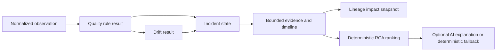

# Evidence and data flow

Each arrow is backed by persisted PostgreSQL records. Quality and drift results preserve their own status semantics; an execution can succeed while the data outcome is `FAIL` or `DRIFT`. RCA ranks evidence and is not causal proof. The optional AI layer receives public-only, bounded evidence and cannot alter the incident, quality, drift, or lineage state.
